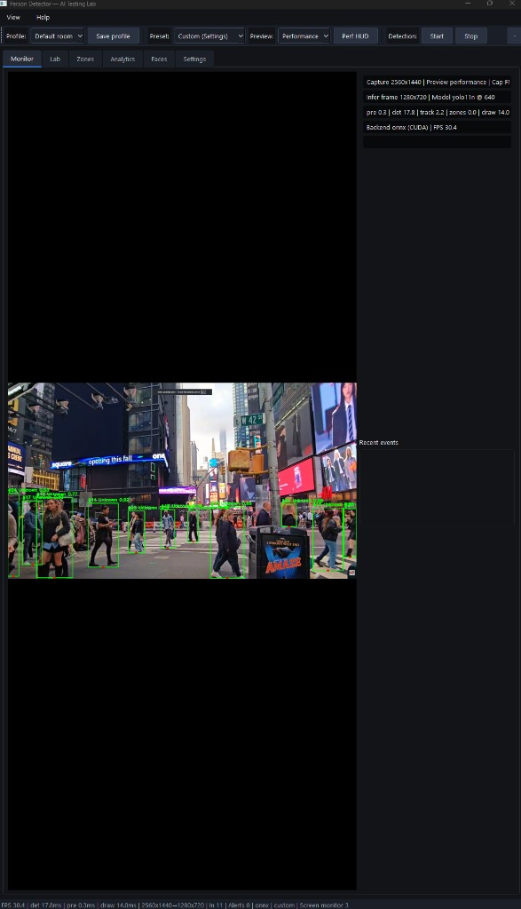
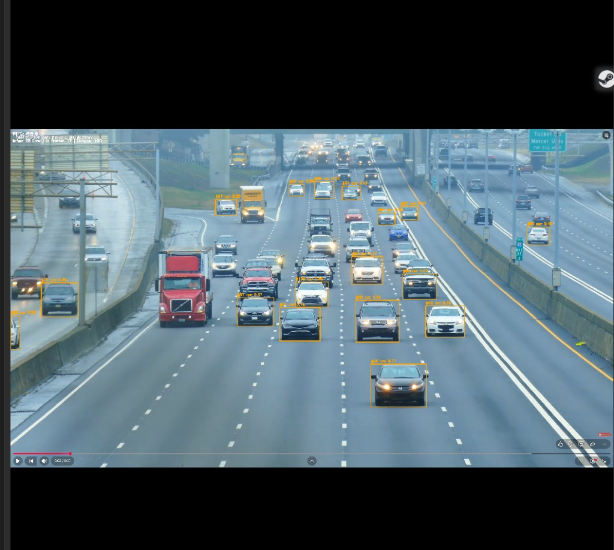
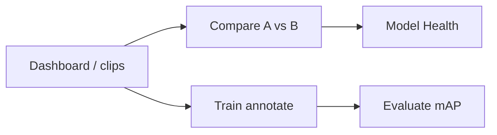

# Human Detector — LIVE and LOCAL

**Real-time object detection on Windows** — webcam, video files, and live desktop capture. Built-in **AI Testing Lab** to train YOLO models, compare detectors side-by-side, and validate on your own footage. Everything runs **on your machine** (no cloud API).

Repository: [github.com/EvanGUTK/Human-Detector-LIVE-and-LOCAL](https://github.com/EvanGUTK/Human-Detector-LIVE-and-LOCAL)

---

## Screenshots

### Desktop capture (Times Square crowd — ONNX CUDA)

Live screen region with tracking, Perf HUD, and ~30 FPS on RTX 4080-class GPU (yolo11n @ 640, infer downscale 1280).



### Highway / CCTV-style car detection

Dense traffic scene with per-vehicle boxes and confidence scores (~45 FPS inference on file replay).



---

## What you can do

| Mode | Description |
|------|-------------|
| **Webcam** | USB / built-in camera, mirror option |
| **Video file** | MP4/AVI/MKV — pause **video** separately from detection |
| **Desktop** | Pick monitor + region (no screen recording export needed) |
| **Zones** | Draw polygons; alerts on person enter (feet-point logic) |
| **Faces** | Local face gallery (InsightFace, on-device) |
| **Lab** | Train → Compare → Evaluate → Model Health |

### Built-in models

| Model | Family | Notes |
|-------|--------|--------|
| YOLO11n/s/m/l/x | YOLO | Auto-export ONNX on first run |
| YOLOv8m | YOLO | Classic vehicle baseline |
| RT-DETR-s | Transformer | Ultralytics export |
| PeopleNet | NVIDIA TAO | NGC download or manual ONNX |
| DetectNet_v2 | NVIDIA TAO | Distinct NGC resource from PeopleNet |
| Custom | Import | Settings → Import ONNX |

---

## Requirements

- **Windows 10/11**
- **Python 3.11+** (development) or use the built `.exe`
- **NVIDIA GPU** recommended (CUDA 12 runtime + **cuDNN 9** on `PATH`)
- Webcam optional (desktop / file modes work without it)

---

## Install (from source)

```powershell
git clone https://github.com/EvanGUTK/Human-Detector-LIVE-and-LOCAL.git
cd Human-Detector-LIVE-and-LOCAL

python -m venv .venv
.\.venv\Scripts\Activate.ps1
pip install -r requirements.txt
```

**GPU check** (should report `GPU: True` and ONNX CUDA):

```powershell
.\scripts\check_gpu.ps1
```

**Launch:**

```powershell
.\run.bat
# or
.\.venv\Scripts\python src\main.py
```

On first run the app exports **YOLO11** weights to `models/` (~30–60 s). Models are gitignored; they download locally.

### cuDNN (required for ONNX GPU)

CUDA toolkit alone is not enough. Add cuDNN 9 **bin** to `PATH`, e.g.:

`C:\Program Files\NVIDIA\CUDNN\v9.22\bin\12.9\x64`

`run.bat` prepends a common cuDNN path automatically.

### Optional: NVIDIA TAO models (PeopleNet / DetectNet_v2)

```powershell
setx NGC_API_KEY "your-ngc-api-key"
# Install NGC CLI from NVIDIA, then use Lab → Model Health → NGC
```

Or place ONNX files manually: `models/peoplenet_tao.onnx`, `models/detectnet_v2_tao.onnx`.

---

## Verify models

```powershell
.\.venv\Scripts\python scripts\verify_models.py
.\.venv\Scripts\python scripts\verify_models.py --skip-gpu --models yolo11n
```

---

## Build standalone executable

```powershell
.\scripts\build_exe.ps1
```

Output: `dist\PersonDetector\PersonDetector.exe` — copy the whole folder to another PC.

---

## Quick start (after launch)

1. **Start** detection (toolbar).
2. Pick a source: **Open video…**, **Use webcam**, or **Desktop capture**.
3. **Settings** → model, classes (COCO picker), confidence, inference size (640/960/1280).
4. **Lab** tab → Compare two models, Train on your clips, Model Health checks.

### Keyboard shortcuts

| Key | Action |
|-----|--------|
| `Space` | Pause / resume **video** (file mode only) |
| `Ctrl+P` | Pause / resume **detection** |
| `D` | Debug overlay (feet point, zone in/out) |

---

## Lab workflow



1. **Dashboard** — index test clips under `%APPDATA%\PersonDetector\clips\`
2. **Compare** — same video, two models, latency + CSV/PNG export
3. **Train** — draw boxes → export YOLO → fine-tune → custom ONNX in registry
4. **Evaluate** — validation mAP, label check, batch folder CSV
5. **Model Health** — test inference, NGC download, export ONNX

---

## Performance (RTX 4080 Super class)

| Setting | Typical result |
|---------|----------------|
| yolo11s @ 640, ONNX CUDA | 60–120+ infer FPS |
| Screen 2560×1440 → infer 1280 | ~15–20 ms det + 30+ end-to-end FPS |
| yolo11n | Higher FPS, slightly lower accuracy |

Benchmark (no GUI):

```powershell
.\.venv\Scripts\python scripts\benchmark.py --seconds 15
.\.venv\Scripts\python scripts\benchmark.py --source screen --infer-max-width 1280
```

---

## Configuration

| Item | Location |
|------|----------|
| User settings | `%APPDATA%\PersonDetector\config.json` |
| Training projects | `%APPDATA%\PersonDetector\lab\projects\` |
| Room profiles | `%APPDATA%\PersonDetector\profiles\` |
| Defaults | `config/default.yaml` |

See [docs/DEPLOY.md](docs/DEPLOY.md) for CI, fork workflow, and release checklist.

---

## CI

GitHub Actions runs on every push to `main`: compile check + `verify_models.py --skip-gpu`. See [.github/workflows/ci.yml](.github/workflows/ci.yml).

---

## Project layout

```
src/           Application (UI, pipeline, detectors)
src/lab/       Training, NGC, model registry
src/core/      Capture, tracking, zones, playback
scripts/       check_gpu, verify_models, benchmark, build_exe
config/        Default YAML
docs/          Deploy guide + screenshots
models/        Downloaded ONNX (gitignored)
```

Developer handoff: [PROJECT_HANDOFF.md](PROJECT_HANDOFF.md)

---

## License

This repository is [MIT](LICENSE).

**Dependencies:** [Ultralytics YOLO](https://github.com/ultralytics/ultralytics) (AGPL-3.0 — review if you distribute commercially), ONNX Runtime, PyQt6, and others listed in `requirements.txt`.
